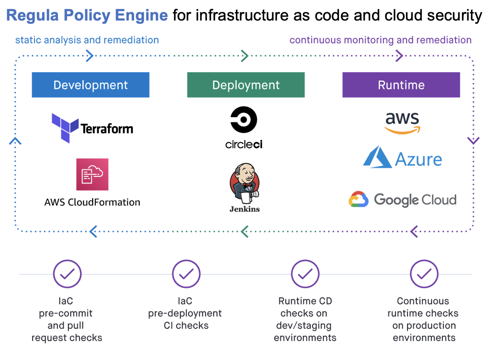

# Securing Terraform IaC with the Regula Policy Engine

This repo contains topics, code snippets, and examples for Fugue's Terraform
security masterclass. The focus is on how to use the **Regula** open source policy
engine to prevent misconfigurations and security vulnerabilities from reaching
production in your cloud.

## Regula

[Regula is an open source project on Github](https://github.com/fugue/regula).
It builds on OPA and the Rego query language to create an easy-to-use
policy engine for resources in Infrastructure-As-Code (IaC).

Rules written for Regula are usable with **both Terraform HCL and Terraform Plans**.
Regula can easily be run during development (e.g. via pre-commit hooks) or in
CI/CD pipelines to check Terraform Plans prior to deployment.

See each topic below, each of which includes example source code and commands
to show how you can eliminate misconfigurations in your Terraform templates.

## The Rego Language

[Rego](https://www.openpolicyagent.org/docs/latest/policy-language/) is the open
source policy language and a key component of the CNCF [Open Policy Agent (OPA)](https://www.openpolicyagent.org/)
project.

## Topics

 1. [The Rego language](./topics/1-rego)
 2. [Rego and Terraform](./topics/2-rego-and-terraform)
 3. [Regula and Terraform](./topics/3-regula-and-terraform)
 4. [IaC Pre-Commit Checks](./topics/4-iac-pre-commit-checks)
 5. [Regula Built-in Rules](./topics/5-regula-builtin-rules)
 6. [Regula Usage](./topics/6-regula-usage)

## References

 * [Regula Documentation](https://regula.dev/)
 * [Regula Built-In Rules](https://regula.dev/rules.html)
 * [The Rego Language](https://www.openpolicyagent.org/docs/latest/policy-language/)
 * [Pre-Commit Hooks for Git](https://pre-commit.com/)
 * [Terraform Plan JSON](https://www.terraform.io/docs/internals/json-format.html)

## About Fugue

Fugue helps teams move faster and more securely in the cloud. Our
[open source projects](https://github.com/fugue) and
[SaaS platform](https://www.fugue.co/) help eliminate misconfigurations and
ensure security both in IaC templates and for resources running in AWS, Azure,
and Google clouds.

You can also check out our [careers page](https://www.fugue.co/careers) if this
sounds like something you'd want to help us with!

